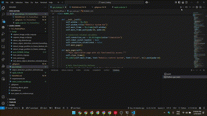

# T2C Pick and Place (ABB CRB 15000 Robot Arm)

This repository contains the codebase to command the **ABB CRB 15000 robot arm** to detect and pick up objects using a custom YOLOv8 AI model. The system currently supports detection and sorting for **PET plastic bottles**, **aluminum cans**, and **snack packets**.

---

## 📺 Showcase

| Auto Pick and Place | Manual Pick and Place |
|:---:|:---:|
|  | *To be implemented* <br> `(path/to/manual_pick.gif)` |

---

## ⚠️ Critical Path & Directory Requirements

The codebase contains hardcoded paths referencing the folder name `T2C_PickAndPlace`. To avoid path resolution errors (especially on case-sensitive operating systems like Linux and macOS):

1. **Rename the Directory**: Ensure the module folder is named exactly **`T2C_PickAndPlace`** (matching the case). If it is cloned or extracted as `T2C_pick_and_place`, rename it before proceeding.
2. **Execute from Parent Directory**: You must run the python commands from the **parent directory** of `T2C_PickAndPlace`.

---

## ⚙️ Setup Instructions

### Prerequisites
* **Python**: Python 3.11 is recommended.
* **ABB RobotStudio**: Required to run the robot simulation (Windows only).

Choose your operating system below for tailored instructions:

### 🪟 Windows Setup
1. **Open Terminal**: Open Command Prompt (CMD) or PowerShell and navigate to the parent directory containing the `T2C_PickAndPlace` folder:
   ```cmd
   cd C:\path\to\parent\directory
   ```
2. **Create a Virtual Environment** (Optional but recommended):
   ```cmd
   python -m venv venv
   venv\Scripts\activate
   ```
3. **Install Requirements**:
   ```cmd
   pip install -r T2C_PickAndPlace/requirements.txt
   ```

### 🐧 Linux Setup
1. **Install Tkinter**: On Linux distributions (e.g., Ubuntu/Debian), Tkinter is not bundled with Python by default and must be installed manually:
   ```bash
   sudo apt-get update
   sudo apt-get install python3-tk
   ```
2. **Open Terminal**: Navigate to the parent directory containing the `T2C_PickAndPlace` folder:
   ```bash
   cd /path/to/parent/directory
   ```
3. **Create a Virtual Environment** (Optional but recommended):
   ```bash
   python3 -m venv venv
   source venv/bin/activate
   ```
4. **Install Requirements**:
   ```bash
   pip install -r T2C_PickAndPlace/requirements.txt
   ```

### 🍎 macOS Setup
1. **Install Tkinter**: If Tkinter is missing from your Python installation, install it via Homebrew:
   ```bash
   brew install python-tk
   ```
2. **Open Terminal**: Navigate to the parent directory containing the `T2C_PickAndPlace` folder:
   ```bash
   cd /path/to/parent/directory
   ```
3. **Create a Virtual Environment** (Optional but recommended):
   ```bash
   python3 -m venv venv
   source venv/bin/activate
   ```
4. **Install Requirements**:
   ```bash
   pip install -r T2C_PickAndPlace/requirements.txt
   ```

---

## 🤖 ABB RobotStudio Simulation Setup (Windows)

> [!NOTE]
> ABB RobotStudio is a Windows-only application. If you are developing on Linux or macOS, you must run RobotStudio on a separate Windows machine or Virtual Machine on the same local network.

1. Download and install **ABB RobotStudio** on your Windows environment.
2. Locate the Pack and Go station file: [Pick_and_Place_Draft.rspag](file:///home/sswaterlab/todo/trash2cash_factory/T2C_pick_and_place/Data/Pick_and_Place_Draft.rspag).
3. Open RobotStudio, select **Pack & Go**, and extract the station.
4. Start the simulation. This starts the virtual controller, which listens for socket connections on port `55000`.
5. **Cross-OS Network Configuration**: If your Python GUI is running on Linux/macOS and RobotStudio is running on Windows:
   * Identify the local IP address of your Windows machine.
   * Open [gui_main.py](file:///home/sswaterlab/todo/trash2cash_factory/T2C_pick_and_place/gui_main.py) and change `SIMULATION_HOST = '127.0.0.1'` to the Windows machine's IP address.

---

## 🚀 How to Run and Test

1. **Activate Environment**: Ensure you are in the parent directory and your virtual environment is active.
2. **Launch the GUI**:
   * **Windows**:
     ```cmd
     python T2C_PickAndPlace/gui_main.py
     ```
   * **Linux / macOS**:
     ```bash
     python3 T2C_PickAndPlace/gui_main.py
     ```
3. **Execution Steps inside the GUI**:
   * Click **Command Robot Arm**.
   * Click **Connect** (Simulation setup).
   * Click **Stationary Objects**.
   * Select either **Manual Pick and Place** or **Auto Pick and Place**.
   * The AI will run object detection on the input image. *Note: Close the detection window to proceed.*
   * Select/verify objects and assign target actions (e.g. incineration or recycling).

---

## 🎥 Video Instruction & Run Tutorial

For a detailed walkthrough, watch the [Full Setup and Run Video on Google Drive](https://drive.google.com/file/d/1IcFKfqSzzJh8pYtEw5DMgpsANgZfK4kQ/view?usp=sharing).



---

